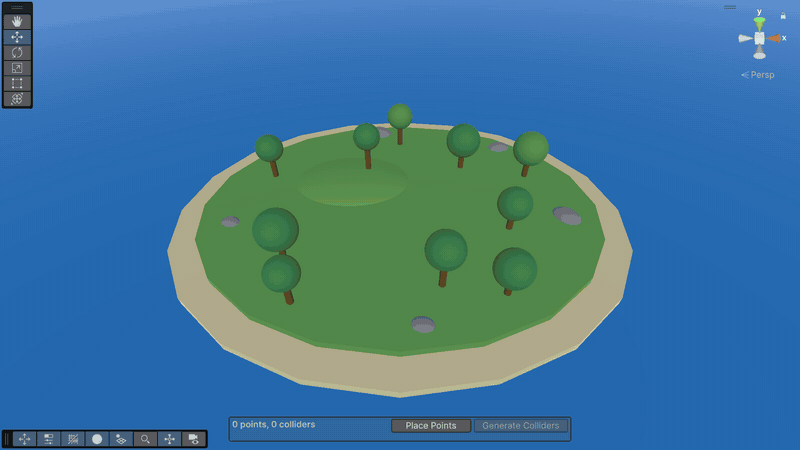

# World Edge Collider Generator

Wall off the edges of your Unity levels in seconds. Click around your level in the Scene view to place points, and the tool generates a chain of box colliders along them so players can't fall off the world.



## Features
- Place points by clicking in the Scene view, with a live preview of the path and the walls it will create.
- Points snap to the geometry under the cursor; hold Shift to keep them level.
- Drag, insert and delete points right in the Scene view, or edit them in the inspector.
- Generate the colliders with one click, and regenerate them any time you change the path. Everything is undoable.
- Works with the Built-in Render Pipeline, URP and HDRP. The component adds nothing at runtime beyond the colliders it creates.

## Requirements
Unity 6 (6000.0) or newer.

## Installation
In Unity, open **Window > Package Manager**, click **+ > Install package from git URL...** and enter:

```
https://github.com/ooxcit/world-edge-collider-generator.git
```

Or add it to `Packages/manifest.json`:

```json
{
  "dependencies": {
    "com.oox.world-edge-collider-generator": "https://github.com/ooxcit/world-edge-collider-generator.git"
  }
}
```

To pin a version, append a tag to the URL, for example `#v0.2.0`.

## Usage
1. Add the **World Edge Collider Generator** component (**Add Component > Oox > World Edge Collider Generator**) to a GameObject.
2. Set the **Height** and **Thickness** of the colliders. Optionally assign a **Box Parent** for the generated colliders; by default they are created under the generator itself.
3. Press **Place Points** in the panel at the bottom of the Scene view (or in the inspector) and click along the edge you want to wall off.
   - The translucent walls show what the colliders will cover.
   - Hold Shift to stay level with the previous point instead of snapping to the geometry under the cursor.
   - Backspace removes the last point.
   - Press Esc, Enter, right-click or **Done** to finish.
4. Adjust the path:
   - Drag a point to move it.
   - Click a point to select it. Its move gizmo allows vertical adjustments, and Delete removes it.
   - Click the green dot in the middle of a segment to insert a point there.
5. Press **Generate Colliders**. The generated colliders are drawn in green while the generator is selected. Generating again replaces them, and **Clear Box Colliders** in the inspector removes them.

The path is always closed: the last point connects back to the first.

## Samples
Import **Basic Setup** from the package's **Samples** tab in the Package Manager for a ready-made generator around a small terrain. It works in any render pipeline.

## Contributing
Issues and pull requests are welcome. Changes reach `master` through reviewed pull requests only.

## License
[MIT](LICENSE.md) © Oox Limited
